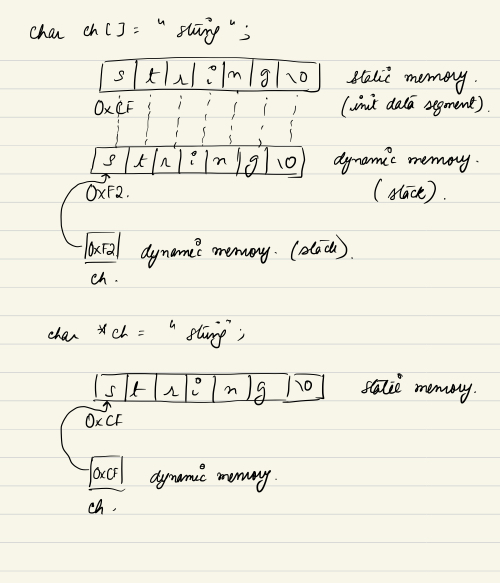

# C idioms

## Robust error checking on system calls
### The wrong
```c
ret_val = system_or_lib_call(...);
if(errno) {...} OR if(errno == ...){}
/* Why is it wrong? Successful syscalls DO NOT reset errno to zero!
 * So in effect we might be checking against the value of errno that
 * was set in a prior system call.
 */
```
### The right
```c
ret_val = system_or_lib_call(..);
if(check if ret_val signals an error condition) //typically -1, NULL etc.
{
	if(errno == SOME_ERR_MACRO) 
	{
		//handle specific case
	}
}
```
### The very right
```c
errno = 0;
ret_val = system_or_lib_call(..);
if(check if ret_val signals an error condition) //typically -1, NULL etc.
{
	if(errno == SOME_ERR_MACRO) 
	{
		//handle specific case
	}
}
```
Example of where the "very right" is necessary: [strtol](https://stackoverflow.com/a/11342986)


## Apply sizeof on variables instead of types

```c
int32 *arr = malloc(sizeof(int32) * 10);
```
If the base type `arr` is going to change, say to `int8`, we would have to change the type on both sides of the assignment above. **Forgetting to do so would lead to a major bug** (think pointer arithmetic).

We can eliminate this possibility by taking the sizeof of the variable in the RHS instead of the sizeof the variable's type.

```c
int32 *arr = malloc(sizeof(*arr) * 10);
```

Note: `sizeof(*arr)` does not involve a dereference of arr, simply the type of the expression (`*arr`) is used.

Demo gpdb: Find malloc(sizeof(*

## Declare array/pointer formal args as constant if they are R/O

If we have a function that takes an array/pointer, and we are certain that we don't want to modify the arguments, we should declare the argument as const.

```c
int sum(const int ar[], int n);
int sum(const int *ar, int n);
void printEmployee(const struct Employee *employee);
```

### Disambiguation

Declaring args as const in the function signature does **NOT** mean that **we have to pass const parameters to it**. It just means that the function cannot modify the parameters. So we can define an array, modify it and then pass it to a function that merely reads it, which wouldn't have been possible if we had to declare the array as a constant.

### Benefits

1. It serves as documentation. It declares the intent of the function very clearly to the caller.
2. If we are designing an interface, this is the only way to enforce our expectation that we don't want the implementor to modify our array/pointer. 
3. The expectation const => R/O is important if we want to look at a function without jumping into its source to figure out it's intent.
4. Allows us to pass in things that were declared const. If we had forgotten to constify the formal args and we tried to pass in a const thing, the compiler would complain.
Example:

```c
int sum(int *ar, int n);
...
const int *ar = {...};
sum(ar, ..); //compilation failure - can't have a pointer point to "const" memory.
// Why? Because we could dereference that pointer and modify the const memory.
```

## Initialize/Reset compound types with {0}

### Initialization

```c
struct ComplexType {
	int a_int;
	float a_float;
	void *a_ptr;
}

struct ComplexType type_instance;

// Attempt to init all struct members to zero values.
memset(&type_instance, 0, sizeof type_instance);
```

The above code snippet is an attempt at initializing a struct to all zero values. The snippet fails at the attempt. What `memset` does is zeroes out all of the bytes of the structure. In effect, it does not assign true zero values to the members - the zero value for floats and pointers is not necessarily bytes with all zeroes.

```c
struct ComplexType type_instance = {0};
```
The above snippet will get us what we desire, tasking the compiler to fill in the zero values.

Demo: gpdb [aocssegfiles.c](https://github.com/greenplum-db/gpdb/blob/72fac8155557de71f3c5606152b22a075a853da7/src/backend/access/aocs/aocssegfiles.c#L418)

### Reset

```c
struct ComplexType a;
struct ComplexType zero = {0};
struct ComplexType arr[SOME_SIZE];
struct ComplexType zeroArr[SOME_SIZE] = {0};
// Manipulate a and arr and fill it with values
...
// Now reset it.
a = {0};
// Since we can't do array assignment.
memcpy(arr, zeroArr, sizeof arr);
```
## Reverse operands on an equality check
```c
if (NULL == ptr)
// helps prevent
if (ptr = NULL)
```

## String variable initializer - array or pointer? const?
```char str[] = "a_string";``` OR  ```char *str = "a_string";``` OR  ```const char *str = "a_string";``` ?
 
 There are major differences in memory layout between the two.
 
 
 
 What if we don't declare a const pointer to a literal? We could have the following **chaos flame**:
 
 ```c
 char *str = "string";
 ch[0] = 't';
 printf("%s", "ttring"); // May print "ttring"
 ```
So the rule of thumb is to init the string as an array only if we plan to modify it. We should init it with a const pointer otherwise.
